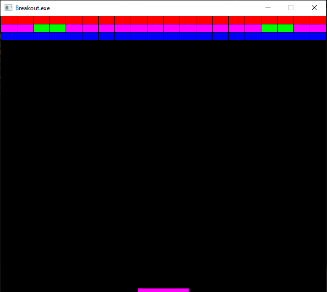

# Breakout

Work in progress

Oldschool breakout game, player needs to hit the bricks to break them. Level is finished when all the brics are broken.

## Requirements: 
 - [x] Levels defined with XML file
 - [x] Level element is the main element containing all the other elements for the level
 - [x] Bricks need to have different strengths (1 hit, 2 hits, etc.)
 - [] Player needs to bounce the ball at different angels
 - [] Game needs to contain three levels
 - [] There needs to be UI displaying current level, score and lives

## Features
- Drawing a level
  - Level is drawn using Simple DirectMedia Layer
  - 

## Tech stack:
- TinyXML
- Allegro
- Simple DirectMedia Layer
